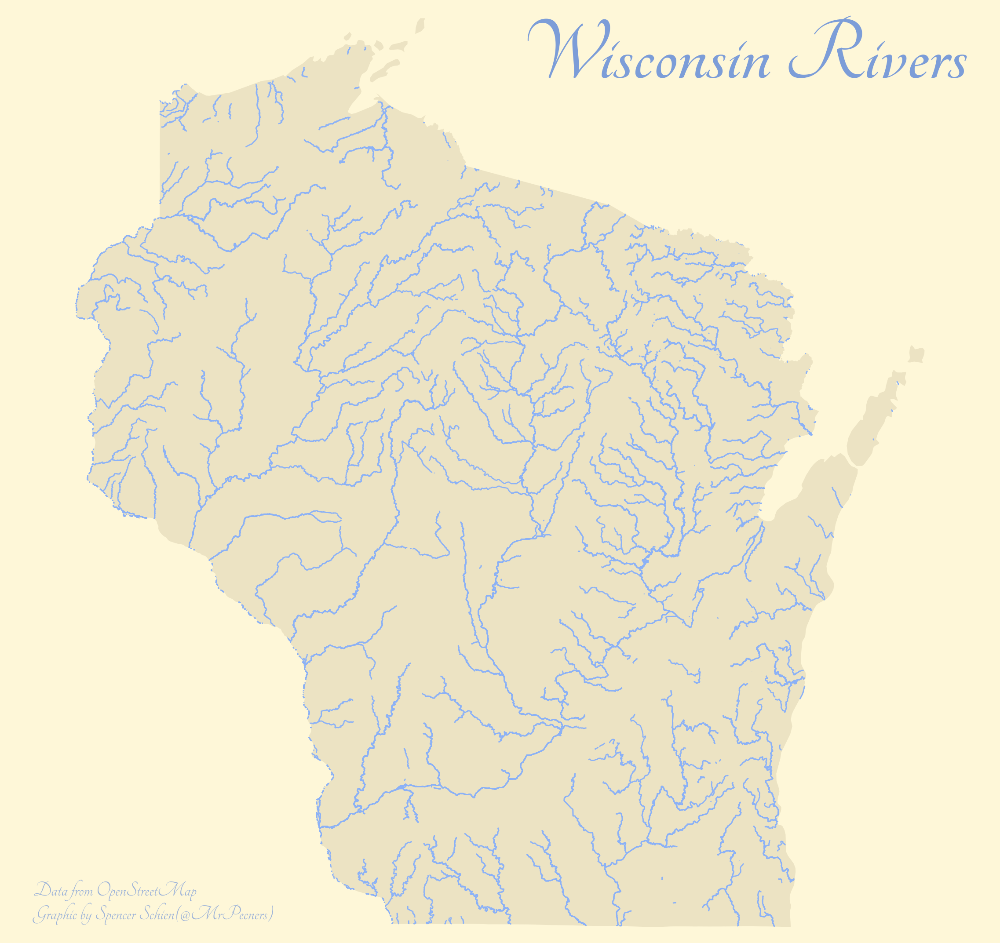

# 30DayChartChallenge

These are my submissions to the [#30DayChartChallenge](https://github.com/dominicroye/30DayChartChallenge_Edition2022).

## [Day 7 - Physical](R/day_7_physical.R)

## [Day 6 - OWID](R/day_6_owid.R)

## [Day 5 - Slope](https://github.com/Pecners/tidytuesday/blob/master/2022/2022-04-05/final_plot.R)

## [Day 4 - Flora](R/day_4_flora.R)

## [Day 3 - Historical](R/day_3_historical.R)

## [Day 2 - Pictogram](R/day_2_pictogram.R)

## [Day 1 - Part of Whole](R/day_1_part_of_whole.R)

