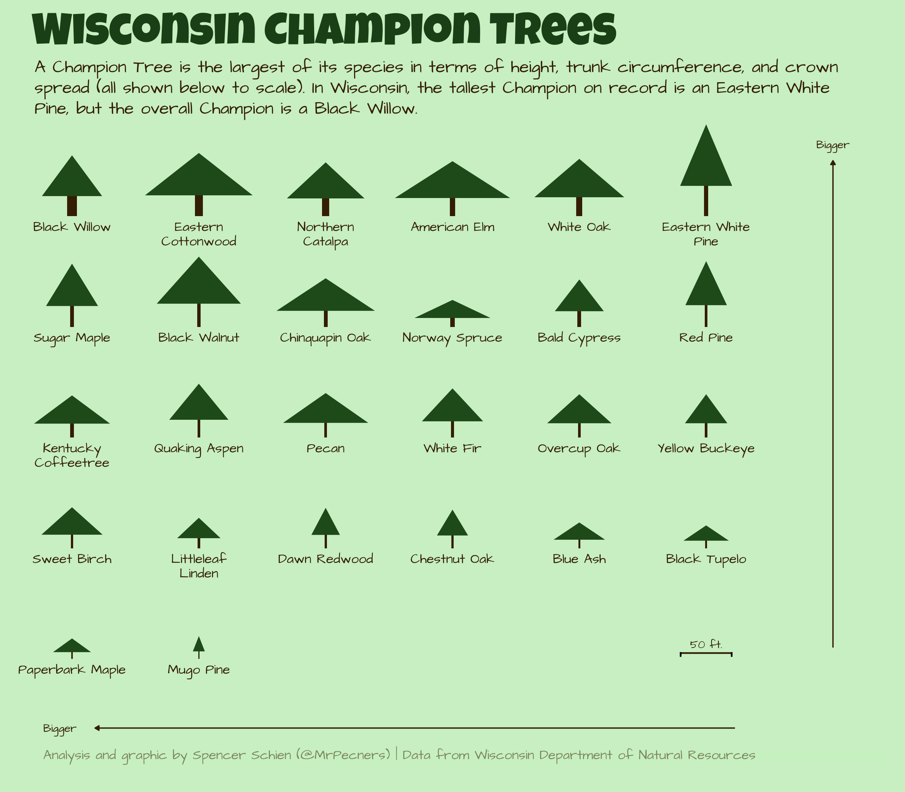
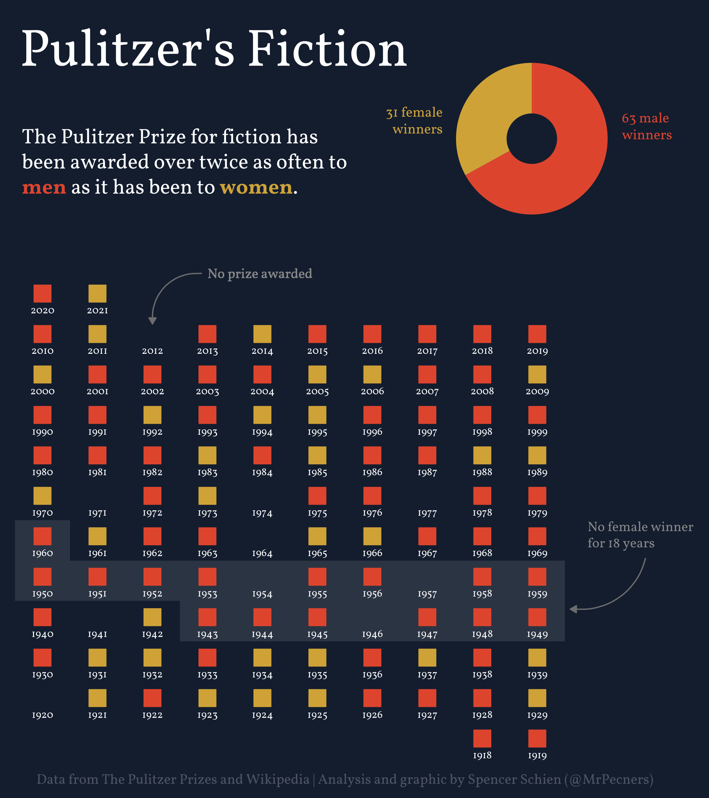

About
================

These are my submissions to the [#30DayChartChallenge](https://github.com/dominicroye/30DayChartChallenge_Edition2022).

Submissions
================

## [Day 21 - Down/Upwards](R/day_21_updown.R)

## [Day 20 - New tool](https://github.com/Pecners/tidytuesday/blob/master/2022/2022-04-19/final_plot.R)

## [Day 18 - OECD](R/day_18_OECD.R)

## [Day 17 - Connections](R/day_17_connections.R)

## [Day 14 - 3-dimensional](R/day_14_3d.R)

https://user-images.githubusercontent.com/47727946/163598117-d14de0a4-7329-4270-9484-033bfd034a0d.mp4

## [Day 13 - Correlation](R/day_13_correlation.R)

## [Day 12 - The Economist theme](https://github.com/Pecners/tidytuesday/blob/master/2022/2022-04-12/final_plot.R)

## [Day 11 - Circular](R/day_11_circular.R)

## [Day 10 - Experimental](R/day_10_experimental.R)

## [Day 8 - Mountains](R/day_8_mountains.R)

## [Day 7 - Physical](R/day_7_physical.R)

## [Day 6 - OWID](R/day_6_owid.R)

## [Day 5 - Slope](https://github.com/Pecners/tidytuesday/blob/master/2022/2022-04-05/final_plot.R)

## [Day 4 - Flora](R/day_4_flora.R)

## [Day 3 - Historical](R/day_3_historical.R)

## [Day 2 - Pictogram](R/day_2_pictogram.R)

## [Day 1 - Part of Whole](R/day_1_part_of_whole.R)

